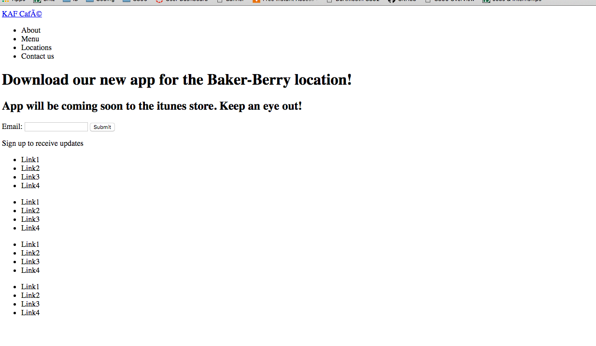

# larissachen.me

## About 
A landing page for a hypothetical KAF app that informs viewers that the App is coming soon and provides links for an about section, a menu, locations, etc. 
Some effects I did included the gradient effect, the responsive dropdown menu and styling buttons. One particular trouble I had was figuring 
out how to do the checkbox dropdown menu hack in only CSS. Online resources said to simply hide the input checkbox with display: none or visibility: hidden
so that the label button lay over it. However, this hid the functionality of the checkbox. So instead I made the opacity of the input checkbox 0, 
and had it lay directly over the label menu button with absolute positioning. I then later realized that because the input checkbox's z-index
had to be greater than that of the label button, this prevented the hover effects of the label button. 

I did create a responsive mobile site implementing the dropdown menu, bigger fonts, and changing the display of the contact section. 

## Screenshot of Layout Stage 

